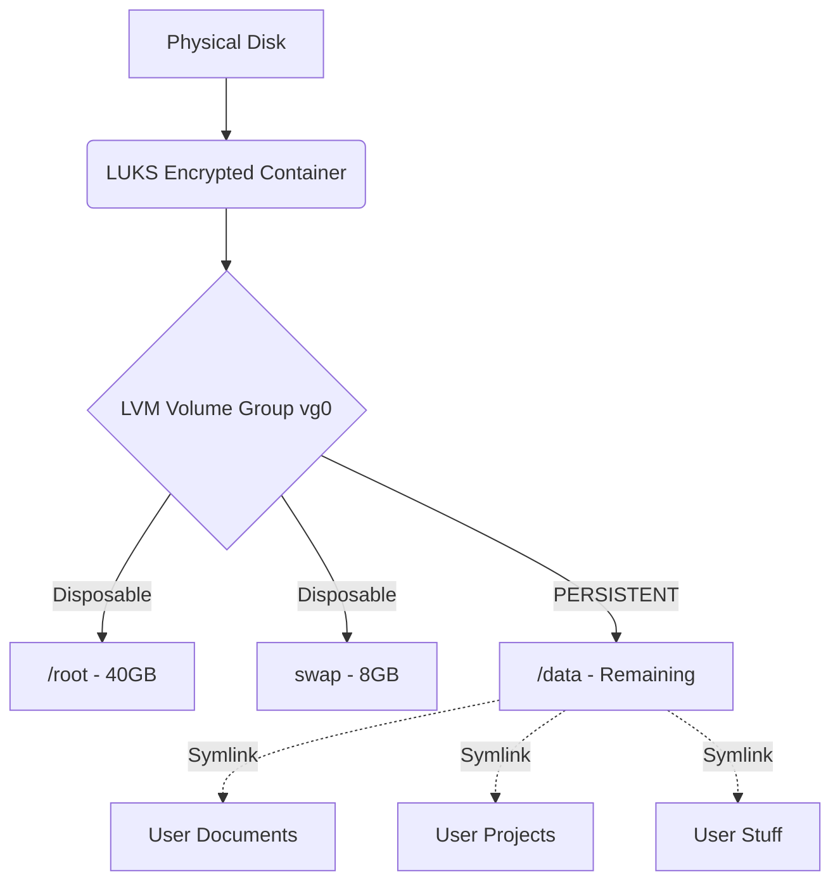

# 🏛️ Project: Arch Sovereign


-success?style=for-the-badge)

> **"The system is transient. Data is eternal."**
> A radical implementation of Arch Linux focusing on strict data separation, security, and minimalist performance for AMD hardware.

---

## 🗺️ Overview & Philosophy

This project documents the journey and development of a reproducible, secure, and high-performance Linux workstation.

The core objective is **Decoupling**: The operating system (`/`) is treated as a "disposable product," while personal data (`/data`) lives on a protected, persistent partition.

### The 3 Pillars of the Project:
1.  **🛡️ Security:** Full-Disk Encryption (LUKS2), Kernel Hardening, AppArmor & UFW enabled by default.
2.  **⚡ Performance:** AMD-optimized stack, zero bloat, pure TTY until user input.
3.  **📦 Isolation:** Applications run in sandboxes (Flatpak) or containers (Docker). The host system remains pristine.

---

## 🏗️ Architecture

System construction details:

| Layer | Technology | Details |
| :--- | :--- | :--- |
| **Hardware** | AMD | Optimized for Ryzen & Radeon (Mesa/Vulkan/Microcode). |
| **Boot** | UEFI / GRUB | Secure Boot ready, Silent Boot. |
| **Disk** | LVM on LUKS | Full encryption with logical volumes (`vg0`). |
| **System** | Arch Linux | Minimal Base Install via **[CALI Installer](./install_script)**. |
| **Interface** | TTY / ZSH | No Display Manager. Login via Console -> Hyprland. |
| **Apps** | Flatpak / Docker | Strict separation of System and Applications. |

### Data Separation (The Vault Strategy)



## 📊 Project Status

Current development state:

### ✅ Completed (Done)
* **The Installer (CALI V40):** A fully automated Bash script that handles partitioning, encryption, and installation.
    * *Features:* Cinema Mode (Quotes), Spinner Animation, Error Handling, ZSH Auto-Config.
* **Base Security:** AppArmor profiles loaded, UFW Default Deny, DNS-over-TLS active.
* **Shell Environment:** ZSH pre-configured with Syntax Highlighting & Autosuggestions.
* **Editor:** Neovim integrated with LazyVim starter template.
* **Virtualization:** Successful tests in QEMU/KVM VM.

### 🚧 In Progress
* **Dotfiles Management:** Automated deployment of Hyprland/Waybar configs post-install.
* **Hyprland Rice:** Fine-tuning the GUI (Animations, Colors, Keybinds).
* **Gaming Setup:** Setting up Steam/Lutris via Flatpak with access permissions to `/data`.

### 🔮 Planned (Future)
* **Backup Strategy:** Automated snapshots of `/data`.
* **Custom ISO:** Building a custom Arch ISO that includes the script out-of-the-box.

---

## 🛠️ Tech Stack & Tools

A curated list of software used:

* **Terminal:** Ghostty (Target) / Kitty (Fallback)
* **Shell:** ZSH (Planned upgrade to Powerlevel10k or Starship)
* **Editor:** LazyVim
* **File Manager:** Yazi (CLI) & Thunar (GUI Fallback)
* **Browser:** Zen Browser (Flatpak)

---

## 📂 Folder Structure

```text
.
├── install_script/     # The Core: The installation script (install.sh)
├── configs/            # (Planned) Hyprland, Waybar, Wofi Configs
├── backup_scripts/     # Helper Scripts (e.g., Backup, Maintenance)
└── README.md           # This file
```
## 🚀 Quick Start (VM Test)

To test the current build in a VM:

1.  Boot the Arch Linux ISO.
2.  Run:
    ```bash
    curl -L https://raw.githubusercontent.com/Gindoma/scripts/main/install.sh | bash
    ```
3.  Sit back and enjoy the show. 🍿

---

<div align="center">
  <b>Project "Arch Sovereign"</b><br>
  <i>Built for Control. Designed for Performance.</i>
</div>
